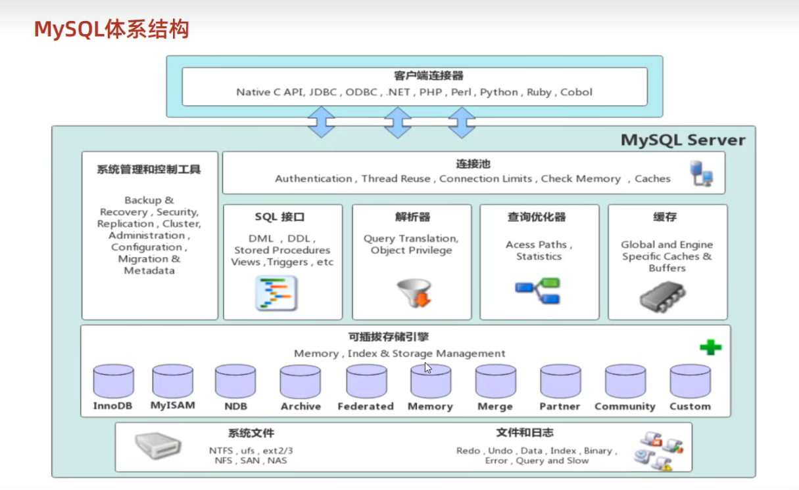
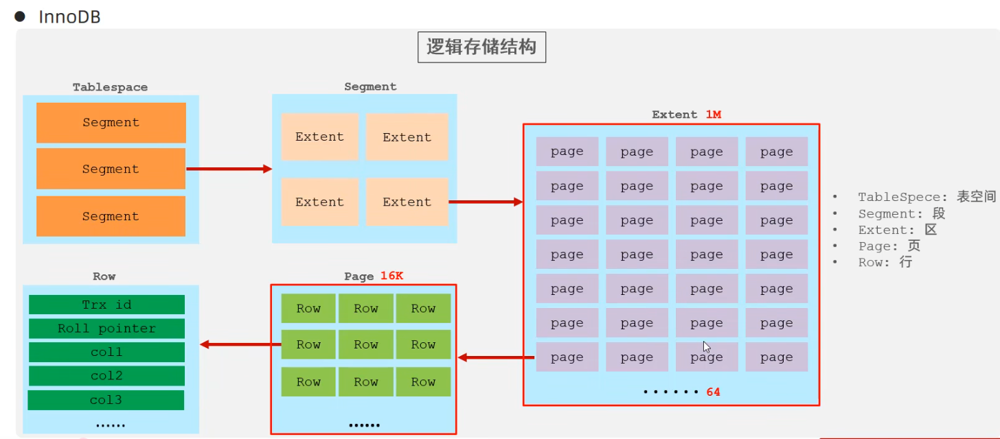
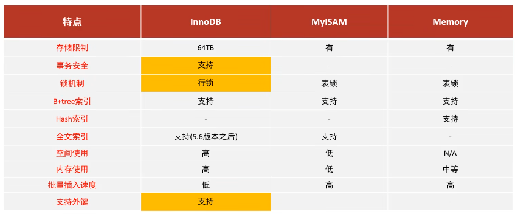
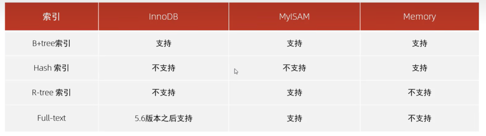
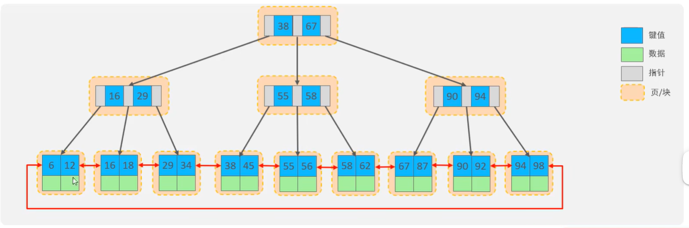

[TOC]

# 一.MySQL基础

## 一.准备工作

1. DB、DBMS、SQL

2. 下载MySQL社区版

3. 命令行输入`net start mysql80`  启动服务

   `net stop mysql80`    停止服务

4. 客户端连接：命令行输入`mysql [-h 127.0.0.1] [-p 3306] -u root -p`host和port可选

5. mysql数据模型：关系型数据库

## 二.SQL

### 1.语法

1. 单行或者多行，分号结尾

2. 不区分大小写，关键字建议大写

3. 注释

   > 单行注释：-- 或 #
   >
   > 多行注释：/*  ...  */

4. SQL分类：DDL、DML、DQL、DCL

### 2.DDL

+ 操作数据库：

  查询：

  ````	sql
  SHOW DATABASES;
  SELECT DATABASE();
  ````

  创建:
  `````sql
  CREATE DATABASE [IF NOT EXISTS] name [DEFAULT CHARSET 字符集] [COLLATE 排序规则];
  `````

  删除:

  `````sql
  DROP DATABASE [IF EXISTS] name;
  `````

  使用:

  `````sql
  USE name;
  `````

  *tips：utf-8字符集存储长度三个字节，有些字符四个字节，使用utf8mb4*

+ 操作表：

  当前数据库所有表：

  ```sql
  SHOW TABLES;
  ```

  查询表结构：

  ````sql
  DESC name;
  ````

  查询指定表的创建语句：

  ````sql
  SHOW CREATE TABLE name;
  ````

  创建表：

  ````sql
  CREATE TABLE表名(
      age TINYINT,
      score DOUBLE(4,1), -- 第一个参数是有效位数如100.0，第二个参数是小数位数
      /*
      varchar节省空间，但是性能不如char
      */
      char name(10), -- 参数为字符长度
      varchar city(10), -- 参数为字符最大长度，可变长
  	...
  	字段n 字段n类型[COMMENT 字段n注释]
  )[COMMENT 表注释]；
  
  
  ````

  

  

  

+ 修改表：

  添加字段：

  `````sql
  ALTER TABLE name ADD 字段名 类型(长度) [COMMENT 注释] [约束];
  `````

  修改字段名和字段类型：

  ````sql
  -- 修改数据类型
  ALTER TABLE 表名 MODIFY 字段名 新数据类型(长度) [COMMENT 注释] [约束];
  -- 修改字段名
  ALTER TABLE 表名 CHANGE 旧字段名 新字段名 类型(长度) [COMMENT 注释] [约束];
  ````

  删除字段：

  ```sql
  ALTER TABLE 表名 DROP 字段名;
  ```

  修改表名：

  ```sql
  ALTER TABLE 表名 RENAME TO 新表名
  ```

  删除表：

  ```sql
  DROP TABLE [IF EXISTS] 表名;
  TRUNCATE TABLE 表名; -- 删除指定表，并重新创建
  ```


### 3.DML

1. Data Manipulation Language

2. 添加数据：

   ```sql
   INSERT INTO 表名 (字段1，字段2...) VALUES (data1,data2...) -- 指定字段
   INSERT INTO 表名 VALUES (data1,data2...) -- 所有字段
   INSERT INTO 表名 (字段1，字段2...) VALUES (data1,data2...),(data1,data2...)... -- 批量
   INSERT INTO 表名 VALUES (data1,data2...),(data1,data2...)... -- 批量
   ```

   - 插入数据时，指定的字段顺序需要与值的顺序是一一对应的
   - **字符串和日期型数据应该包含在引号中**
   - 插入的数据大小，应该在字段的规定范围内。

3. 修改数据

   ```sql
   UPDATE 表名 SET 字段名1=值1,字段2=值2...[WHERE 条件];
   ```

4. 删除数据：

   ```sql
   DELETE FROM 表名 [WHERE 条件]
   ```

   + DELETE语句的条件可以有，也可以没有，如果没有条件，则会删除整张表的所有数据。
   + DELETE语句不能删除某一个字段的值（可以使用UPDATE)。

### 4.DQL

1. DQL英文全称是Data Query Language(数据查询语言)，数据查询语言，用来查询数据库中表的记录。

2. ```SQL
   SELECT
   	字段列表
   FROM
   	表名列表
   WHERE
   	条件列表
   GROUP BY
   	分组字段列表
   HAVING
   	分组后条件列表
   ORDER BY
   	排序字段列表
   LIMIT
   	分页参数
   ```

3. 基本查询
   条件查询(WHERE)
   聚合函数(count、max、min、avg、sum)
   分组查询(GROUP BY)
   排序查询(ORDER BY)
   分页查询(LIMIT)

4. + 查询返回多个字段

     ```sql
     SELECT 字段1,字段2...FROM 表名;
     SELECT * FROM 表名;
     SELECT 字段1 [AS 别名1]... FROM 表名; -- as可省略
     SELECT DISTINCT 字段列表 FROM 表名; -- 去除重复
     ```

   + 条件查询

     ```sql
     SELECT 字段 FROM 表名 WHERE 条件列表;
     -- 查询年龄等于18或20或40的员工信息
     select from emp where age in(18,20,40); -- in的用法
     -- 查询姓名为两个字的员工信息
     select from emp where name like '__'; -- like用法
     ```
     
     | 比较运算符         | 功能                                        |
     | ------------------ | ------------------------------------------- |
     | >、>=、<、<=、=    | 略                                          |
     | <> 或 !=           | 不等于                                      |
     | between ... and... | 范围内，包含最大最小值                      |
     | IN(...)            | 在in之后的列表中的值，多选一                |
     | LIKE 占位符        | 模糊匹配（_ 匹配单个字符，%匹配任意个字符） |
     | IS NULL            | 是空                                        |
     | AND 或 &&          | 与                                          |
     | OR 或 \|\|         | 或                                          |
     | NOT 或 !           | 非                                          |
     
   + 聚合函数：将一列数据作为一个整体，进行纵向计算

     常见聚合函数：count、max、min、avg、sum

     ```sql
     SELECT 聚合函数(字段列表) FROM 表名;
     ```
   
     **注意：所有null值不参与聚合函数计算**

   + 分组查询

     ```sql
     SELECT 字段列表 FROM 表名 [WHERE条件] GROUP BY 分组字段名 [HAVING分组后过滤条件];
     -- 1.根据性别分组，统计男性员工和女性员工的数量
     select gender,count(*)from emp group by gender;
     -- 2.根据性别分组，统计男性员工和女性员工的平均年龄
     select gender,avg(age)from emp group by gender;
     -- 3.查询年龄小于45的员工，并根据工作地址分组，获取员工数量大于等于3的工作地址
     select workaddress,count(*) address_count from emp where age < 45 group by workaddress having address_count > 3;
     ```
   
     where与having区别

     + 执行时机不同：where.是分组之前进行过滤，不满足where条件，不参与分组；而having是分组之后对结果进行过滤。
     + 判断条件不同：where不能对聚合函数进行判断，而having可以。
   
     注意

     + 执行顺序：where>聚合函数>having。
     + 分组之后，查询的字段一般为聚合函数和分组字段，查询其他字段无任何意义。
   
   + 排序查询

     ```SQL
     SELECT 字段列表 FROM 表名 ORDER BY 字段1 排序方式1，字段2 排序方式2;
     -- 排序方式：
     -- ASC：升序（默认）
     -- DESC：降序
     -- 注意：如果是多字段排序，当第一个字段值相同时，才会根据第二个字段进行排序。
     ```
   
   + 分页查询：

     ```sql
     SELECT 字段列表 FROM 表名 LIMIT 起始索引，查询记录数;
     ```
   
     注意：

     + 起始索引从0开始，起始索引=（查询页码-1)*每页显示记录数。
     + 分页查询是数据库的方言，不同的数据库有不同的实现，MySQL中是LIMIT。
     + 如果查询的是第一页数据，起始索引可以省略，直接简写为limit 10。
   
   + ```sql
     -- 1.查询年龄为20,21,22,23岁的女性员工信息。
     select from emp where gender ='女' and age in(20,21,22,23);
     -- 2.查询性别为男，并且年龄在20-40岁（含）以内的姓名为三个字的员工。
     select from emp where gender ='男' and(age between 20 and 40) and name like '___'
     -- 3.统计员工表中，年龄小于60岁的，男性员工和女性员工的人数。
     select gender,count(*) from emp where age<60 group by gender;
     -- 4.查询所有年龄小于等于35岁员工的姓名和年龄，并对查询结果按年龄升序排序，如果年龄相同按入职时间降序排序。
     select name,age from emp where age <35 order by age asc,entrydate desc;
     -- 5.查询性别为男，且年龄在20-40岁（含）以内的前5个员工信息，对查询的结果按年龄升序排序，年龄相同按入职时间升序排序。
     select from emp where gender ='男' and age between 20 and 40 order by age asc,entrydate asc limit 5;
     ```
   
   + DQL执行顺序

     

### 5.DCL

1. DCL英文全称是Data Control Language(数据控制语言)，用来管理数据库用户、控制数据库的访问权限。

2. + 查询用户

     ````sql
     USE mysql;
     SELECT * FROM user;
     ````

   + 创建用户

     ```sql
     CREATE USER '用户名'@'主机名' IDENTIFIED BY '密码'; -- 如主机名可以使用%通配
     ```

   + 修改用户密码

     ```sql
     ALTER USER '用户名'@'主机名' IDENTIFIED WITH mysql_native_password BY '新密码';
     ```

   + 删除用户

     ```sql
     DROP USER '用户名'@'主机名'
     ```

3. 权限控制

   | 权限               | 说明               |
   | ------------------ | ------------------ |
   | ALL,ALL PRIVILEGES | 所有权限           |
   | SELECT             | 查询数据           |
   | INSERT             | 插入数据           |
   | UPDATE             | 修改数据           |
   | DELETE             | 删除数据           |
   | ALTER              | 修改表             |
   | DROP               | 删除数据库/表/视图 |
   | CREATE             | 创建数据库/表      |

   + 查询权限

     ```sql
     SHOW GTANTS FOR '用户名'@'主机名';
     ```

   + 授予权限

     ```sql
     GRANT 权限列表 ON 数据库名.表名 TO '用户名'@'主机名';
     ```

   + 撤销权限

     ```sql
     REVOKE 权限列表 ON 数据库名.表名 FROM '用户名'@'主机名';
     ```

## 三.函数

1. 指一段可以被另一段程序调用的程序或代码

2. 字符串函数：

   

   ```sql
   select concat('hello',' mysql'); -- 'hello mysql'
   select LPAD('abc',6,'rt'); -- 'rtrabc'
   select SUBSTR('hello mysql',1,5); -- 'hello'，这太反人类了，竟然下标从1开始，而且还包括最后一个字符
   select SUBSTR('hello mysql' from 2 for 6); -- 'ello m'，似乎这样更方便，从2开始，截取6个，如果长度比截取到最后还长，那就只保留到最后
   ```

3. 数值函数

   

4. 日期函数

   

5. 流程函数

   

## 四.约束

1. 概念：约束是作用于表中字段上的规则，用于限制存储在表中的数据。

2. 目的：保证数据库中数据的正确、有效性和完整性。

3. 分类

   

4. 约束演示

   ```sql
   PRIMARY AUTO_INCREMENT -- 主键，自动增长
   -- 多个约束用空格分开
   check (age > 0 && age <= 120)
   ```

5. 外键约束

   + 概念：外键用来让两张表的数据之间建立连接，从而保证数据的一致性和完整性。

   + ```sql
     -- 创建表时
     CREATE TABLE表名(
     	字段名	数据类型
     	[CONSTRAINI] [外键名称] FOREIGN KEY(外键字段名) REFERENCES 主表(主表列名)
     );
     -- 修改表时
     ALTER TABLE 表名 ADD CONSTRAINT 外键名称 FOREIGN KEY(外键字段名) REFERENCES 主表（主表列名）;
     -- 删除外键
     ALTER TABLE 表名 drop foreign key 外键名称;
     -- 添加外键时后可以加行为 on update 行为 on delete 行为
     ```

   + 

## 五.多表查询

1. 多表关系：项目开发中，在进行数据库表结构设计时，会根据业务需求及业务模块之间的关系，分析并设计表结构，由于业务之间相互关联，所以各个表结构之间也存在着各种联系，基本上分为三种：

   + 一对多：多的一方建立外键，指向一的一方的主键
   + 多对多：建立第三张中间表，中间表至少包含两个外键，分别关联两方主键
   + 一对一：在任意一方加入外键，关联另外一方的主键，并且设置外键为唯一的(UNIQUE)

2. 多表查询分类：

   + 连接查询：

     内连接、外连接、自连接

   + 子查询

   1. 内连接：查询两张表的交集部分

   ```sql
   -- 隐式内连接
   SELECT 字段列表 FROM 表1，表2 WHERE 条件...;
   -- 显式内连接
   SELECT 字段列表 FROM 表1 [INNER] JOIN 表2 连接条件...;
   ```

   2. 外连接：

   ```sql
   SELECT 字段列表 FROM 表1 LEFT [OUTER] JOIN 表2 ON条件..：
   -- 相当于查询表1（左表）的所有数据包含表1和表2交集部分的数据
   SELECT 字段列表 FROM 表1 RIGHT [OUTER] JOIN 表2 ON条件..：
   -- 相当于查询表2（右表）的所有数据包含表1和表2交集部分的数据
   ```

   3. 自连接：

   ```sql
   SELECT 字段列表 FROM 表A 别名A JOIN 表A 别名B ON 条件;
   -- 自连接查询，可以是内连接查询，也可以是外连接查询。
   ```

   4. 联合查询

   ```sql
   SELECT 字段列表 FROM 表A ...
   UNION [ALL]
   SELECT 字段列表 FROM 表B ...;
   -- 删掉all可以去重
   -- 多张表列数应一致，数据类型也应一致
   ```

   5. 子查询

   ```sql
   -- 嵌套SELECT语句，成为嵌套查询，又称子查询
   SELECT * FROM t1 WHERE column1 = (SELECT column1 FROM t2);
   -- 子查询外部语句可以是INSERT、update、delete、SELECT
   根据子查询结果不同，分为：
   	标量子查询（子查询结果为单个值）
   	列子查询（子查询结果为一列）
   	行子查询（子查询结果为一行）
   	表子查询（子查询结果为多行多列）
   根据子查询位置，分为：WHERE之后、FROM之后、SELECT之后。
   ```

3. 练习

   ```sql
   -- 1.查询员工的姓名、年龄、职位、部门信息。
   -- 2.查询年龄小于30岁的员工姓名、年龄、职位、部门信息。
   -- 3.查询拥有员工的部门D、部门名称。
   -- 4.查询所有年龄大于40岁的员工，及其归属的部门名称：如果员工没有分配部门，也需要展示出来。
   -- 5.查询所有员工的工资等级。
   -- 6.查询"研发部"所有员工的信息及工资等级。
   -- 7.查询"研发部”员工的平均工资。
   -- 8.查询工资比"灭绝"高的员工信息。
   -- 9.查询比平均薪资高的员工信息。
   -- 10.查询低于本部门平均工资的员工信息。
   -- 11.查询所有的部门信息，并统计部门的员工人数。
   -- 12.查询所有学生的选课情况，展示出学生名称，学号，课程名称
   ```


## 六.事务

1. 事务：事务是一组操作的集合，它是一个不可分割的工作单位，事务会把所有的操作作为一个整体一起向系统提交或撤销操作请求，即这些操作要么同时成功，要么同时失败

   ```sql
   -- mysql事务默认自动提交
   -- 保证事务完整性
   -- 方式一：可以改成手动提交
   SHOW VARIABLES LIKE 'autocommit';
   SELECT @@autocommit;
   SET @@autocommit=0;
   /*
   tips
   @@global 仅仅用于标记全局变量；
   @@session 仅仅用于标记会话变量；
   @@首先标记会话变量，如果会话变量不存在，则标记全局变量。
   */
   -- 选择数据库
    use db;
    -- 修改数据
    update account set money = money - 500 where name = 'jack';
    -- 手动提交
    commit;
    -- 回滚事务
    rollback;
    -- 方式二：
    start transaction;
    -- 等价于begin
    ...
    commit or rollback;
   ```

2. 事务四大特性：

   + 原子性(Atomicity):事务是不可分割的最小操作单元，要么全部成功，要么全部失败。
   + 一致性(Consistency)：事务完成时，必须使所有的数据都保持一致状态。
   + 隔离性(Isolation)：数据库系统提供的隔离机制，保证事务在不受外部并发操作影响的独立环境下运行。
   + 持久性(Durability）：事务一旦提交或回滚，它对数据库中的数据的改变就是永久的。

3. 并发事务问题

   + 脏读：一个事务读到另外一个事务还没有提交的数据。
   + 不可重复读：一个事务先后读取同一条记录，但两次读取的数据不同，称之为不可重复读。
   + 幻读：一个事务按照条件查询数据时，没有对应的数据行，但是在插入数据时，又发现这行数据已经存在，好像出现了"幻影"。

4. 事务隔离级别

   + Read uncdmmitted(oracle默认) ：可能导致脏读、不可重复读、幻读
   + Read committed ：可能导致不可重复读、幻读
   + Repeatable Read(mysql默认) ：可能导致幻读
   + Serializable ：不会导致上述问题

   ```sql
   -- 查看事务隔离级别
   SELECT @@TRANSACTION_ISOLATION
   -- 设置事务隔离级别
   SET [SESSION|GLOBAL] TRANSACTION ISOLATION LEVEL {READ UNCOMMITTED|READ COMMITTED| REPEATABLE|SERIALIZABLE}
   ```


# 二.进阶

## 一.存储引擎

1. mysql体系结构

   + 连接层：最上层是一些客户端和链接服务，主要完成一些类似于连接处理、授权认证、及相关的安全方案。服务器也会为安全接入的每个客户端验证它所具有的操作权限。
   + 服务层：第二层架构主要完成大多数的核心服务功能，如SQL接口，并完成缓存的查询，SQL的分析和优化，部分内置函数的执行。所有跨存储引擎的功能也在这一层实现，如过程、函数等。
   + 引擎层：存储引擎真正的负责了MySOL中数据的存储和提取，服务器通过AP和存储引擎进行通信。不同的存储引擎具有不同的功能，这样我们可以根据自己的需要，来选取合适的存储引擎。
   + 存储层：主要是将数据存储在文件系统之上，并完成与存储引擎的交互。

   

   

2. 存储引擎

   + 简介：存储引擎就是存储数据、建立索引、更新/查询数据等技术的实现方式。存储引擎是基于表的，而不是基于库的，所以存储引擎也可被称为表类型。

   + ```sql
     -- 创建表时指定引擎(默认InnoDB)
     create table name(
     ...
     )ENGINE = INNODB;
     -- 查看当前数据库支持的存储引擎
     show engines;
     ```

3. 存储引擎特点

   + InnoDB：InnoDB是一种兼顾高可靠性和高性能的通用存储引擎，在MySQL5.5之后，InnoDB是默认的MySQL存储引擎。

     >特点：
     >
     >​	DML操作遵循ACID模型，支持事务；
     >​	行级锁，提高并发访问性能；
     >​	支持外键FOREIGN KEY约束，保证数据的完整性和正确性；
     >
     >文件：
     >
     >​	XXX.ibd：xxx代表的是表名，innoDB引擎的每张表都会对应这样一个表空间文件，存储该表的表结构(frm、sdi)、数据和索引。
     >
     >​	参数：innodb_file_per_table（查看每张表是否单独存储在一个文件）
     >
     >​	终端输入`ibd2sdi xxx.ibd`可查看sdi表结构数据

     

   + MyISAM：是MySQL早期的默认存储引擎。

     > 特点：
     > 	不支持事务，不支持外键
     > 	支持表锁，不支持行锁
     > 	访问速度快
     >
     > 文件
     > 	xxx.sdi:存储表结构信息
     > 	xxx.MYD:存储数据
     > 	xxx.MYI:存储索引

   + Memory：Memory引擎的表数据时存储在内存中的，由于受到硬件问题、或断电问题的影响，只能将这些表作为临时表或缓存使用。

     > 特点：
     >
     > ​	内存存放
     >
     > ​	hash索引（默认）
     >
     > 文件：
     >
     > ​	xxx.sdi：存储表结构信息

   

4. 存储引擎选择

   在选择存储引擎时，应该根据应用系统的特点选择合适的存储引擎。对于复杂的应用系统，还可以根据实际情况选择多种存储引擎进行组合。

   > InnoDB:是Mysql的默认存储引擎，支持事务、外键。如果应用对事务的完整性有比较高的要求，在并发条件下要求数据的一致性，数据操作除了插入和查询之外，还包含很多的更新、删除操作，那么InnoDB存储引擎是比较合适的选择。
   >
   > MyISAM：如果应用是以读操作和插入操作为主，只有很少的更新和删除操作，并且对事务的完整性、并发性要求不是很高，那么选择这个存储引擎是非常合适的。(现大部分被MongoDB替代)
   >
   > MEMORY:将所有数据保存在内存中，访问速度快，通常用于临时表及缓存。MEMORYE的缺陷是对表的大小有限制，太大的表无法缓存在内存中，而且无法保障数据的安全性。(现大部分被Redis替代)

## 二.索引

### 1.准备工作

1. linux版本mysql安装：官网下载安装包，命令行依次安装各个包，

   ```shell
   [stephen@localhost mysql]$ ls # 查看mysql文件
   mysql-community-client-8.4.0-1.el8.x86_64.rpm
   ...
   mysql-community-test-debuginfo-8.4.0-1.el8.x86_64.rpm
   
   [stephen@localhost mysql]$ su # 提权，用户Stephen无权安装
   Password: 
   [root@localhost mysql]# rpm -ivh mysql-community-common-8.4.0-1.el8.x86_64.rpm
   [root@localhost mysql]# rpm -ivh mysql-community-icu-data-files-8.4.0-1.el8.x86_64.rpm
   [root@localhost mysql]# rpm -ivh mysql-community-client-plugins-8.4.0-1.el8.x86_64.rpm
   [root@localhost mysql]# rpm -qa | grep -E 'mysql|mariadb' # 如果有mariadb程序需要删掉，删除命令为:rpm -e --nodeps xxx
   [root@localhost mysql]# rpm -ivh mysql-community-libs-8.4.0-1.el8.x86_64.rpm
   [root@localhost mysql]# rpm -ivh mysql-community-client-8.4.0-1.el8.x86_64.rpm
   [root@localhost mysql]# rpm -ivh mysql-community-server-8.4.0-1.el8.x86_64.rpm
   ```

2. 修改数据库默认密码

   ```shell
   [root@localhost mysql]# systemctl start mysqld # 开启数据库
   [root@localhost mysql]# systemctl status mysqld # 查看状态
   ● mysqld.service - MySQL Server
      Loaded: loaded (/usr/lib/systemd/system/mysqld.service; enabled; vendor preset: disab>
      Active: active (running) since Wed 2024-09-11 00:42:30 PDT; 7s ago
        Docs: man:mysqld(8)
              http://dev.mysql.com/doc/refman/en/using-systemd.html
     Process: 74010 ExecStartPre=/usr/bin/mysqld_pre_systemd (code=exited, status=0/SUCCESS)
    Main PID: 74469 (mysqld)
      Status: "Server is operational"
       Tasks: 36 (limit: 4780)
      Memory: 258.0M
      CGroup: /system.slice/mysqld.service
              └─74469 /usr/sbin/mysqld
   
   Sep 11 00:42:19 localhost.localdomain systemd[1]: Starting MySQL Server...
   Sep 11 00:42:30 localhost.localdomain systemd[1]: Started MySQL Server.
   
   [root@localhost mysql]# systemctl enable mysqld # 允许开机自启
   [root@localhost mysql]# grep 'temporary password' /var/log/mysqld.log
   2024-09-11T07:42:25.015336Z 6 [Note] [MY-010454] [Server] A temporary password is generated for root@localhost: Y;/:9bSEbTp& # 此处为初始密码
   [root@localhost mysql]# mysql -u root -p
   Enter password: 
   Welcome to the MySQL monitor.  Commands end with ; or \g.
   Your MySQL connection id is 10
   Server version: 8.4.0
   ...
   mysql> ALTER USER 'root'@'localhost' IDENTIFIED BY '2432757689'; # 修改简单密码会不符合条件，需要修改复杂密码，包含数字，大小写字母，符号，八位以上
   mysql> ALTER USER 'root'@'localhost' IDENTIFIED BY '2432757689Hll.';
   Query OK, 0 rows affected (0.01 sec)
   mysql> set global validate_password.policy = 0; # 修改密码校验规则为最低
   Query OK, 0 rows affected (0.01 sec)
   mysql> set global validate_password.length = 6; # 修改密码长度最低六位
   Query OK, 0 rows affected (0.00 sec)
   mysql> ALTER USER 'root'@'localhost' IDENTIFIED BY '243275'; # 此时即可修改为简单密码
   Query OK, 0 rows affected (0.00 sec)
   ```

3. 关闭linux防火墙，允许在windows系统的数据库软件操作linux虚拟机中的数据库

   ```shell
   mysql> create user 'root'@'%' IDENTIFIED WITH caching_sha2_password BY '243275'; # 创建用户名root，密码243275
   Query OK, 0 rows affected (0.01 sec)
   mysql> quit # 关闭数据库
   Bye
   [root@localhost mysql]# ifconfig # 查看本机ip地址，下面inet即为ip地址
   ens160: ...
           inet 192.168.17.130  netmask 255.255.255.0  broadcast 192.168.17.255
           ...
   
   [root@localhost mysql]# sudo systemctl status firewalld # 查看linux防火墙
   [root@localhost mysql]# sudo firewall-cmd --zone=public --add-port=3306/tcp --permanent ## 开放3306端口
   success
   [root@localhost mysql]# sudo firewall-cmd --reload # 重新加载防火墙
   success
   [root@localhost mysql]# sudo firewall-cmd --list-ports # 查看已开放端口
   3306/tcp
   ```

### 2.索引

1. 介绍：索引（index)是帮助MySQL高效获取数据的数据结构（有序）。在数据之外，数据库系统还维护着满足特定查找算法的数据结构，这些数据结构以某种方式引用（指向）数据，这样就可以在这些数据结构上实现高级查找算法，这种数据结构就是索引。

2. 索引优缺点：

   优势：

   + 提高数据检索的效率，降低数据库的成本
   + 通过索引列对数据进行排序，降低数据排序的成本，降低CPU的消耗。

   劣势：

   + 索引大大提高了查询效率，同时却也降低更新表的速度，如对表进
     行INSERT、UPDATE、DELETE时，效率降低。
   + 索引列也是要占用空间的。

3. 常见索引结构：

   | 索引结构            | 描述                                                         |
   | ------------------- | ------------------------------------------------------------ |
   | B+Tree索引          | 最常见的索引类型，大部分引擎都支持B+树索引                   |
   | Hash索引            | 底层数据结构是用哈希表实现的，只有精确匹配索引列的查询才有效，不支持范围查询 |
   | R-tree(空间索引)    | 空间索引是MyISAM引擎的一个特殊索引类型，主要用于地理空间数据类型，通常使用较少 |
   | Full-text(全文索引) | 是一种通过建立倒排索引，快速匹配文档的方式。类似于Lucene,Solr,ES |

4. 

5. 二叉树缺点：顺序插入时，会形成一个链表，查询性能大大降低。大数据量情况下，层级较深，检索速度慢。
   红黑树：大数据量情况下，层级较深，检索速度慢。

6. [数据结构和算法可视化网站](https://www.cs.usfca.edu/~galles/visualization/Algorithms.html)

7. B-Tree、B+Tree

   > B+Tree非叶子结点做索引，所有元素都存在叶子结点
   >
   > B+Tree叶子结点形成单向链表

8. mysql的B+Tree：MySQL索引数据结构对经典的B+Tree进行了优化。在原B+Tree的基础上，增加一个指向相邻叶子节点的链表指针，就形成了带有顺序
   指针的B+Tree,提高区间访问的性能。

   

9. hash索引：哈希索引就是采用一定的hash算法，将键值换算成新的hash值，映射到对应的槽位上，然后存储在hash表中。
   如果两个（或多个）键值，映射到一个相同的槽位上，他们就产生了hash冲突（也称为hash碰撞），可以通过链表来解决。

   > Hash索引特点：
   > 1.Hash索引只能用于对等比较(=，in),不支持范围查询(between,>,<,…)
   > 2.无法利用索引完成排序操作
   > 3.查询效率高，通常只需要一次检索就可以了，效率通常要高于B+tree索引
   >
   > 存储引擎支持：
   > 在MySQL中，支持hash索引的是Memory引擎，而InnoDB中具有自适应hash功能，hash索引是存储引擎根据B+Tree索引在指定条件下自动构建的。

10. 为什么InnoDB存储引擎选择使用B+tree索引结构？

    + 相对于二叉树，层级更少，搜索效率高；
    + 对于B-tree,无论是叶子节点还是非叶子节点，都会保存数据，这样导致一
      页中存储的键值减少，指针跟着减少，要同样保存大量数据，只能增加树的
      高度，导致性能降低
    + 对于hash索引，B+Tree支持范围匹配和排序操作

### 3.索引分类

1. 主键索引：针对于表中主键创建的索引，默认自动创建，只能有一个 PRIMARY
   唯一索引：避免同一个表中某数据列中的值重复，可以有多个 UNIQUE
   常规索引：快速定位特定数据，可以有多个
   全文索引：全文索引查找的是文本中的关键词，而不是比较索引中的值，可以有多个 FULLTEXT

2. 根据存储形式分类

   + 聚集索引Clustered Index
     将数据存储与索引放到了一块，索引结构的叶子节点保存了行数据
     必须有，而且只有一个
   + 二级索引(Secondary Index)（辅助索引，非聚集索引）
     将数据与索引分开存储，索引结构的叶子节点关联的是对应的主键
     可以存在多个

   聚集索引选取规则：
   >如果存在主键，主键索引就是聚集索引。
   >如果不存在主键，将使用第一个唯一(UNIQUE)索引作为聚集索引。
   >如果表没有主键，或没有合适的唯一索引，则InnoDB会自动生成一个rowid作为隐藏的聚集索引。

   回表查询：先通过二级索引找到值，在通过id去聚集索引查找那一行

###  4.索引语法

1. 创建索引

   ```sql
   CREATE [UNIQUE|FULLTXT] INDEX index_name ON table(index_col_name,...);
   ```

2. 查看索引

   ```sql
   SHOW INDEX FROM table_name;
   ```

3. 删除索引

   ```sql
   DROP INDEX index_name ON table_name；
   ```


### 5.sql性能分析

1. ```sql
   SHOW [GLOBAL|session] status like 'Com_______'; -- 查看数据库INSERT、update、delete、SELECT访问频次
   ```

2. 慢查询日志

   慢查询日志记录了所有执行时间超过指定参数(long_quey_time,单位：秒，默认10秒)的所有SQL语句的日志。

   ```sql
   -- 查看慢查询日志是否开启
   show variables like 'slow_query_log';
   ```

   MySQL的慢查询日志默认没有开启，需要在MySQL的配置文件(/etc/my.cnf)中配置如下信息：

   ```sql
   slow_query_log=1
   long_query_time=2
   ```

3. profile

   show profiles能够在做SQL优化时帮助我们了解时间都耗费到哪里去了。通过nave profiling参数，能够看到当前MySQL是否支持profile操作：

   ```sql
   SELECT @@have_profiling;
   ```

   默认关闭，可以通过set语句在session/global级别开启profiling

   ```sql
   set profiling = 1;
   ```

   ```sql
   # 查看每一条sql的耗时基本情况
   show profiles;
   # 查看指定query_id的SQL语句各个阶段的耗时情况
   show profile for query query_id;
   # 查看指定query id的SQL语句CPU的使用情况
   show profile cpu for query query_id;
   ```

4. explain执行计划：

   EXPLAIN或者DESC命令获取MySQL如何执行SELECT语句的信息，包括在SELECT语句执行过程中表如何连接和连接的顺序。

   ```sql
   # 直接在select语句前加上关键字explain/desc
   EXPLAIN SELECT 字段列表 FROM 表名 WHERE 条件;
   ```

   explain执行计划各字段含义：

   + id：select查询的序列号，表示查询中执行select子句或者是操作表的顺序(id相同，执行顺序从上到下；id不同，值越大，越先执行)。
   + select type：表示SELECT的类型，常见的取值有SIMPLE(简单表，即不使用表连接或者子查询)、PRIMARY(主查询，即外层的查询)、UNION (UNION中的第二个或者后面的查询语句)、SUBQUERY(SELECT/WHERE之后包含了子查询)等（了解）
   + type：表示连接类型，性能由好到差的连接类型为NULL、system、const、eq_ref、ref、range、index、all。
   + possible key：显示可能应用在这张表上的索引，一个或多个。
   + Key：实际使用的索引，如果为NU儿L,则没有使用索引。
   + Key_len：表示索引中使用的字节数，该值为索引字段最大可能长度，并非实际使用长度，在不损失精确性的前提下，长度越短越好。
   + rows：MySQL认为必须要执行查询的行数，在innodb引擎的表中，是一个估计值，可能并不总是准确的。
   + filtered：表示返回结果的行数占需读取行数的百分比，filtered的值越大越好。

5. 索引使用原则：

   + **最左前缀法则**：如果索引了多列（联合索引），要遵守最左前缀法则。最左前缀法则指的是查询从索引的最左列开始，并且不跳过索引中的列。如果跳跃某一列，索引将部分失效（后面的字段索引失效）。

   + 索引失效情况一：不要在索引列上进行运算操作，索引将失效

     ```sql
     substring(phone,10,2)='15';
     ```

   + 字符串不加引号：字符串类型字段使用时，不加引号，索引将失效

   + 模糊查询：如果仅仅是尾部模糊匹配，索引不会失效，如果是头部模糊匹配，索引失效

   + or连接的条件：用or分割开的条件，如果or前的条件中的列有索引，而后面的列中没有索引，那么涉及的索引都不会被用到

   + 数据分布影响：如果MySQL评估使用索引比全表更慢，则不使用索引

   + SQL提示：是优化数据库的一个重要手段，简单来说，就是在SQL语句中加入一些人为的提示来达到优化操作的目的。

     ```sql
     use index		//建议
     ignore index	//忽略
     force index		//强制
     select * from user use index(idx_usr_name) where ...;
     ```

   + 覆盖索引：尽量使用覆盖索引（查询使用了索引，并且需要返回的列，在该索引中已经全部能够找到），减少select*。（避免回表查询）

   + 前缀索引：当字段类型为字符串(varchar,text等)时，有时候需要索引很长的字符串，这会让索引变得很大，查询时，浪费大量的磁盘IO,影响查询效率。此时可以只将字符串的一部分前缀，建立索引，这样可以大大节约索引空间，从而提高索引效率。

     ```sql
     create index idx_xxx on table(column(n));
     -- 前缀长度：可以根据索引的选择性来决定，而选择性是指不重复的索引值（基数）和数据表的记录总数的比值，索引选择性越高则查询效率越高，唯一索引的选择性是1，这是最好的索引选择性，性能也是最好的。
     ```

   + 单列索引和联合索引：（一个索引包含单个/多个列）在业务场景中，如果存在多个查询条件，考虑针对于查询字段建立索引时，建议建立联合索引，而非单列索引。

6. 索引设计原则

   1. 针对于数据量较大，且查询比较频繁的表建立索引。
   2. 针对于常作为查询条件(where)、排序(order by)、分组（group by)操作的字段建立索引。
   3. 尽量选择区分度高的列作为索引，尽量建立唯一索引，区分度越高，使用索引的效率越高。
   4. 如果是字符串类型的字段，字段的长度较长，可以针对于字段的特点，建立前缀索引。
   5. 尽量使用联合索引，减少单列索引，查询时，联合索引很多时候可以覆盖索引，节省存储空间，避免回表，提高查询效率。
   6. 要控制索引的数量，索引并不是多多益善，索引越多，维护索引结构的代价也就越大，会影响增删改的效率。
   7. 如果索引列不能存储NULL值，请在创建表时使用NOT NULL约束它。当优化器知道每列是否包含NULL值时，它可以更好地确定哪个索引最有效地用于查询。

   


