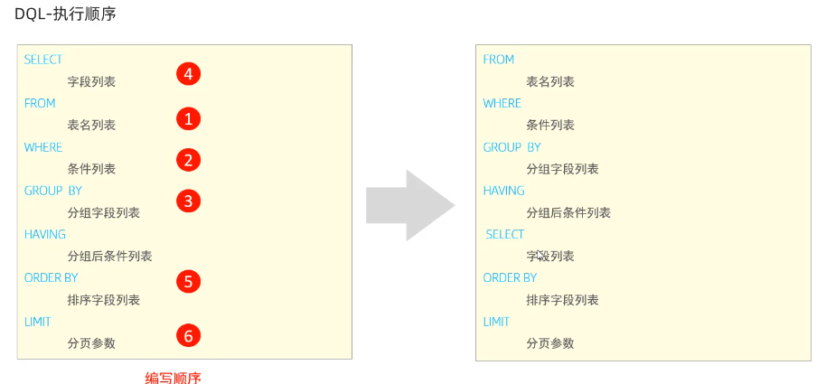

[TOC]

## 一.MySQL基础

### 准备工作

1. DB、DBMS、SQL

2. 下载MySQL社区版

3. 命令行输入`net start mysql80`  启动服务

   `net stop mysql80`    停止服务

4. 客户端连接：命令行输入`mysql [-h 127.0.0.1] [-p 3306] -u root -p`host和port可选

### mysql数据模型

+ 关系型数据库

## 二.SQL

### 1.语法

1. 单行或者多行，分号结尾

2. 不区分大小写，关键字建议大写

3. 注释

   > 单行注释：-- 或 #
   >
   > 多行注释：/*  ...  */

4. SQL分类：DDL、DML、DQL、DCL

### 2.DDL

+ 操作数据库：

  查询：

  ````	sql
  SHOW DATABASES;
  SELECT DATABASE();
  ````

  创建:
  `````sql
  CREATE DATABASE [IF NOT EXISTS] name [DEFAULT CHARSET 字符集] [COLLATE 排序规则];
  `````

  删除:

  `````sql
  DROP DATABASE [IF EXISTS] name;
  `````

  使用:

  `````sql
  USE name;
  `````

  *tips：utf-8字符集存储长度三个字节，有些字符四个字节，使用utf8mb4*

+ 操作表：

  当前数据库所有表：

  ```sql
  SHOW TABLES;
  ```

  查询表结构：

  ````sql
  DESC name;
  ````

  查询指定表的创建语句：

  ````sql
  SHOW CREATE TABLE name;
  ````

  创建表：

  ````sql
  CREATE TABLE表名(
      age TINYINT,
      score DOUBLE(4,1), -- 第一个参数是有效位数如100.0，第二个参数是小数位数
      /*
      varchar节省空间，但是性能不如char
      */
      char name(10), -- 参数为字符长度
      varchar city(10), -- 参数为字符最大长度，可变长
  	...
  	字段n 字段n类型[COMMENT 字段n注释]
  )[COMMENT 表注释]；
  
  
  ````

  

  

  

+ 修改表：

  添加字段：

  `````sql
  ALTER TABLE name ADD 字段名 类型(长度) [COMMENT 注释] [约束];
  `````

  修改字段名和字段类型：

  ````sql
  -- 修改数据类型
  ALTER TABLE 表名 MODIFY 字段名 新数据类型(长度) [COMMENT 注释] [约束];
  -- 修改字段名
  ALTER TABLE 表名 CHANGE 旧字段名 新字段名 类型(长度) [COMMENT 注释] [约束];
  ````

  删除字段：

  ```sql
  ALTER TABLE 表名 DROP 字段名;
  ```

  修改表名：

  ```sql
  ALTER TABLE 表名 RENAME TO 新表名
  ```

  删除表：

  ```sql
  DROP TABLE [IF EXISTS] 表名;
  TRUNCATE TABLE 表名; -- 删除指定表，并重新创建
  ```


### 3.DML

1. Data Manipulation Language

2. 添加数据：

   ```sql
   INSERT INTO 表名 (字段1，字段2...) VALUES (data1,data2...) -- 指定字段
   INSERT INTO 表名 VALUES (data1,data2...) -- 所有字段
   INSERT INTO 表名 (字段1，字段2...) VALUES (data1,data2...),(data1,data2...)... -- 批量
   INSERT INTO 表名 VALUES (data1,data2...),(data1,data2...)... -- 批量
   ```

   - 插入数据时，指定的字段顺序需要与值的顺序是一一对应的
   - **字符串和日期型数据应该包含在引号中**
   - 插入的数据大小，应该在字段的规定范围内。

3. 修改数据

   ```sql
   UPDATE 表名 SET 字段名1=值1,字段2=值2...[WHERE 条件];
   ```

4. 删除数据：

   ```sql
   DELETE FROM 表名 [WHERE 条件]
   ```

   + DELETE语句的条件可以有，也可以没有，如果没有条件，则会删除整张表的所有数据。
   + DELETE语句不能删除某一个字段的值（可以使用UPDATE)。

### 4.DQL

1. DQL英文全称是Data Query Language(数据查询语言)，数据查询语言，用来查询数据库中表的记录。

2. ```SQL
   SELECT
   	字段列表
   FROM
   	表名列表
   WHERE
   	条件列表
   GROUP BY
   	分组字段列表
   HAVING
   	分组后条件列表
   ORDER BY
   	排序字段列表
   LIMIT
   	分页参数
   ```

3. 基本查询
   条件查询(WHERE)
   聚合函数(count、max、min、avg、sum)
   分组查询(GROUP BY)
   排序查询(ORDER BY)
   分页查询(LIMIT)

4. + 查询返回多个字段

     ```sql
     SELECT 字段1,字段2...FROM 表名;
     SELECT * FROM 表名;
     SELECT 字段1 [AS 别名1]... FROM 表名; -- as可省略
     SELECT DISTINCT 字段列表 FROM 表名; -- 去除重复
     ```

   + 条件查询

     ```sql
     SELECT 字段 FROM 表名 WHERE 条件列表;
     -- 查询年龄等于18或20或40的员工信息
     select from emp where age in(18,20,40); -- in的用法
     -- 查询姓名为两个字的员工信息
     select from emp where name like '__'; -- like用法
     
     
     ```

     | 比较运算符         | 功能                                        |
     | ------------------ | ------------------------------------------- |
     | >、>=、<、<=、=    | 略                                          |
     | <> 或 !=           | 不等于                                      |
     | between ... and... | 范围内，包含最大最小值                      |
     | IN(...)            | 在in之后的列表中的值，多选一                |
     | LIKE 占位符        | 模糊匹配（_ 匹配单个字符，%匹配任意个字符） |
     | IS NULL            | 是空                                        |
     | AND 或 &&          | 与                                          |
     | OR 或 \|\|         | 或                                          |
     | NOT 或 !           | 非                                          |

   + 聚合函数：将一列数据作为一个整体，进行纵向计算

     常见聚合函数：count、max、min、avg、sum

     ```sql
     SELECT 聚合函数(字段列表) FROM 表名;
     ```

     **注意：所有null值不参与聚合函数计算**

   + 分组查询

     ```sql
     SELECT 字段列表 FROM 表名 [WHERE条件] GROUP BY 分组字段名 [HAVING分组后过滤条件];
     -- 1.根据性别分组，统计男性员工和女性员工的数量
     select gender,count(*)from emp group by gender;
     -- 2.根据性别分组，统计男性员工和女性员工的平均年龄
     select gender,avg(age)from emp group by gender;
     -- 3.查询年龄小于45的员工，并根据工作地址分组，获取员工数量大于等于3的工作地址
     select workaddress,count(*) address_count from emp where age < 45 group by workaddress having address_count > 3;
     ```

     where与having区别

     + 执行时机不同：where.是分组之前进行过滤，不满足where条件，不参与分组；而having是分组之后对结果进行过滤。
     + 判断条件不同：where不能对聚合函数进行判断，而having可以。

     注意

     + 执行顺序：where>聚合函数>having。
     + 分组之后，查询的字段一般为聚合函数和分组字段，查询其他字段无任何意义。

   + 排序查询

     ```SQL
     SELECT 字段列表 FROM 表名 ORDER BY 字段1 排序方式1，字段2 排序方式2;
     -- 排序方式：
     -- ASC：升序（默认）
     -- DESC：降序
     -- 注意：如果是多字段排序，当第一个字段值相同时，才会根据第二个字段进行排序。
     ```

   + 分页查询：

     ```sql
     SELECT 字段列表 FROM 表名 LIMIT 起始索引，查询记录数;
     ```

     注意：

     + 起始索引从0开始，起始索引=（查询页码-1)*每页显示记录数。
     + 分页查询是数据库的方言，不同的数据库有不同的实现，MySQL中是LIMIT。
     + 如果查询的是第一页数据，起始索引可以省略，直接简写为limit 10。

   + ```sql
     -- 1.查询年龄为20,21,22,23岁的女性员工信息。
     select from emp where gender ='女' and age in(20,21,22,23);
     -- 2.查询性别为男，并且年龄在20-40岁（含）以内的姓名为三个字的员工。
     select from emp where gender ='男' and(age between 20 and 40) and name like '___'
     -- 3.统计员工表中，年龄小于60岁的，男性员工和女性员工的人数。
     select gender,count(*) from emp where age<60 group by gender;
     -- 4.查询所有年龄小于等于35岁员工的姓名和年龄，并对查询结果按年龄升序排序，如果年龄相同按入职时间降序排序。
     select name,age from emp where age <35 order by age asc,entrydate desc;
     -- 5.查询性别为男，且年龄在20-40岁（含）以内的前5个员工信息，对查询的结果按年龄升序排序，年龄相同按入职时间升序排序。
     select from emp where gender ='男' and age between 20 and 40 order by age asc,entrydate asc limit 5;
     ```

   + DQL执行顺序

     

### 5.DCL

1. DCL英文全称是Data Control Language(数据控制语言)，用来管理数据库用户、控制数据库的访问权限。

2. + 查询用户

     ````sql
     USE mysql;
     SELECT * FROM user;
     ````

   + 创建用户

     ```sql
     CREATE USER '用户名'@'主机名' IDENTIFIED BY '密码'; -- 如主机名可以使用%通配
     ```

   + 修改用户密码

     ```sql
     ALTER USER '用户名'@'主机名' IDENTIFIED WITH mysql_native_password BY '新密码';
     ```

   + 删除用户

     ```sql
     DROP USER '用户名'@'主机名'
     ```

3. 权限控制

   | 权限               | 说明               |
   | ------------------ | ------------------ |
   | ALL,ALL PRIVILEGES | 所有权限           |
   | SELECT             | 查询数据           |
   | INSERT             | 插入数据           |
   | UPDATE             | 修改数据           |
   | DELETE             | 删除数据           |
   | ALTER              | 修改表             |
   | DROP               | 删除数据库/表/视图 |
   | CREATE             | 创建数据库/表      |

   + 查询权限

     ```sql
     SHOW GTANTS FOR '用户名'@'主机名';
     ```

   + 授予权限

     ```sql
     GRANT 权限列表 ON 数据库名.表名 TO '用户名'@'主机名';
     ```

   + 撤销权限

     ```sql
     REVOKE 权限列表 ON 数据库名.表名 FROM '用户名'@'主机名';
     ```

## 三.函数

1. 指一段可以被另一段程序调用的程序或代码

2. 字符串函数：

   

   ```sql
   select concat('hello',' mysql'); -- 'hello mysql'
   select LPAD('abc',6,'rt'); -- 'rtrabc'
   select SUBSTR('hello mysql',1,5); -- 'hello'，这太反人类了，竟然下标从1开始，而且还包括最后一个字符
   select SUBSTR('hello mysql' from 2 for 6); -- 'ello m'，似乎这样更方便，从2开始，截取6个，如果长度比截取到最后还长，那就只保留到最后
   ```

3. 数值函数

   

4. 日期函数

   

5. 流程函数

   

## 四.约束

1. 概念：约束是作用于表中字段上的规则，用于限制存储在表中的数据。

2. 目的：保证数据库中数据的正确、有效性和完整性。

3. 分类

   

4. 约束演示

   ```sql
   PRIMARY AUTO_INCREMENT -- 主键，自动增长
   -- 多个约束用空格分开
   check (age > 0 && age <= 120)
   ```

5. 外键约束

   + 概念：外键用来让两张表的数据之间建立连接，从而保证数据的一致性和完整性。

   + ```sql
     -- 创建表时
     CREATE TABLE表名(
     	字段名	数据类型
     	[CONSTRAINI] [外键名称] FOREIGN KEY(外键字段名) REFERENCES 主表(主表列名)
     );
     -- 修改表时
     ALTER TABLE 表名 ADD CONSTRAINT 外键名称 FOREIGN KEY(外键字段名) REFERENCES 主表（主表列名）;
     -- 删除外键
     ALTER TABLE 表名 drop foreign key 外键名称;
     -- 添加外键时后可以加行为 on update 行为 on delete 行为
     ```

   + 

## 五.多表查询

1. 多表关系：项目开发中，在进行数据库表结构设计时，会根据业务需求及业务模块之间的关系，分析并设计表结构，由于业务之间相互关联，所以各个表结构之间也存在着各种联系，基本上分为三种：

   + 一对多：多的一方建立外键，指向一的一方的主键
   + 多对多：建立第三张中间表，中间表至少包含两个外键，分别关联两方主键
   + 一对一：在任意一方加入外键，关联另外一方的主键，并且设置外键为唯一的(UNIQUE)

2. 多表查询分类：

   + 连接查询：

     内连接、外连接、自连接

   + 子查询

   1. 内连接：查询两张表的交集部分

   ```sql
   -- 隐式内连接
   SELECT 字段列表 FROM 表1，表2 WHERE 条件...;
   -- 显式内连接
   SELECT 字段列表 FROM 表1 [INNER] JOIN 表2 连接条件...;
   ```

   2. 外连接：

   ```sql
   SELECT 字段列表 FROM 表1 LEFT [OUTER] JOIN 表2 ON条件..：
   -- 相当于查询表1（左表）的所有数据包含表1和表2交集部分的数据
   SELECT 字段列表 FROM 表1 RIGHT [OUTER] JOIN 表2 ON条件..：
   -- 相当于查询表2（右表）的所有数据包含表1和表2交集部分的数据
   ```

   3. 自连接：

   ```sql
   SELECT 字段列表 FROM 表A 别名A JOIN 表A 别名B ON 条件;
   -- 自连接查询，可以是内连接查询，也可以是外连接查询。
   ```

   4. 联合查询

   ```sql
   SELECT 字段列表 FROM 表A ...
   UNION [ALL]
   SELECT 字段列表 FROM 表B ...;
   -- 删掉all可以去重
   -- 多张表列数应一致，数据类型也应一致
   ```

   5. 子查询

   ```sql
   -- 嵌套SELECT语句，成为嵌套查询，又称子查询
   SELECT * FROM t1 WHERE column1 = (SELECT column1 FROM t2);
   -- 子查询外部语句可以是INSERT、update、delete、SELECT
   根据子查询结果不同，分为：
   	标量子查询（子查询结果为单个值）
   	列子查询（子查询结果为一列）
   	行子查询（子查询结果为一行）
   	表子查询（子查询结果为多行多列）
   根据子查询位置，分为：WHERE之后、FROM之后、SELECT之后。
   ```

3. 练习

   ```sql
   -- 1.查询员工的姓名、年龄、职位、部门信息。
   -- 2.查询年龄小于30岁的员工姓名、年龄、职位、部门信息。
   -- 3.查询拥有员工的部门D、部门名称。
   -- 4.查询所有年龄大于40岁的员工，及其归属的部门名称：如果员工没有分配部门，也需要展示出来。
   -- 5.查询所有员工的工资等级。
   -- 6.查询"研发部"所有员工的信息及工资等级。
   -- 7.查询"研发部”员工的平均工资。
   -- 8.查询工资比"灭绝"高的员工信息。
   -- 9.查询比平均薪资高的员工信息。
   -- 10.查询低于本部门平均工资的员工信息。
   -- 11.查询所有的部门信息，并统计部门的员工人数。
   -- 12.查询所有学生的选课情况，展示出学生名称，学号，课程名称
   ```


## 六.事务

1. 事务：事务是一组操作的集合，它是一个不可分割的工作单位，事务会把所有的操作作为一个整体一起向系统提交或撤销操作请求，即这些操作要么同时成功，要么同时失败

   ```sql
   -- mysql事务默认自动提交
   -- 保证事务完整性
   -- 方式一：可以改成手动提交
   SHOW VARIABLES LIKE 'autocommit';
   SELECT @@autocommit;
   SET @@autocommit=0;
   /*
   tips
   @@global 仅仅用于标记全局变量；
   @@session 仅仅用于标记会话变量；
   @@首先标记会话变量，如果会话变量不存在，则标记全局变量。
   */
   -- 选择数据库
    use db;
    -- 修改数据
    update account set money = money - 500 where name = 'jack';
    -- 手动提交
    commit;
    -- 回滚事务
    rollback;
    -- 方式二：
    start transaction;
    -- 等价于begin
    ...
    commit or rollback;
   ```

2. 事务四大特性：

   + 原子性(Atomicity):事务是不可分割的最小操作单元，要么全部成功，要么全部失败。
   + 一致性(Consistency)：事务完成时，必须使所有的数据都保持一致状态。
   + 隔离性(Isolation)：数据库系统提供的隔离机制，保证事务在不受外部并发操作影响的独立环境下运行。
   + 持久性(Durability）：事务一旦提交或回滚，它对数据库中的数据的改变就是永久的。

3. 并发事务问题

   + 脏读：一个事务读到另外一个事务还没有提交的数据。
   + 不可重复读：一个事务先后读取同一条记录，但两次读取的数据不同，称之为不可重复读。
   + 幻读：一个事务按照条件查询数据时，没有对应的数据行，但是在插入数据时，又发现这行数据已经存在，好像出现了"幻影"。

4. 事务隔离级别

   + Read uncdmmitted(oracle默认) ：可能导致脏读、不可重复读、幻读
   + Read committed ：可能导致不可重复读、幻读
   + Repeatable Read(mysql默认) ：可能导致幻读
   + Serializable ：不会导致上述问题

   ```sql
   -- 查看事务隔离级别
   SELECT @@TRANSACTION_ISOLATION
   -- 设置事务隔离级别
   SET [SESSION|GLOBAL] TRANSACTION ISOLATION LEVEL {READ UNCOMMITTED|READ COMMITTED| REPEATABLE|SERIALIZABLE}
   ```

   


